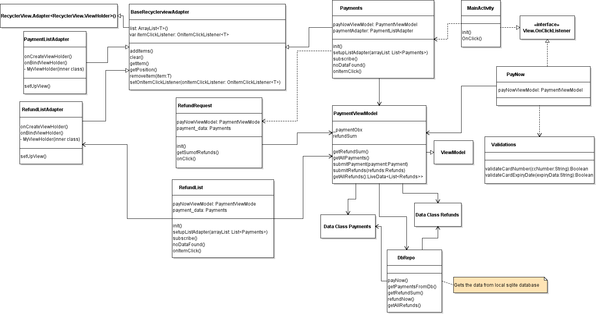

# Switch Challenge - Payment App

This is an android application written in 'KOTLIN' that lets you:

- Pay Online using Master/Visa cards.
- Enables you to request for refund either partial or in full.
- displays your payment history
---
This app is designed using android's Jetpack components such as :

- ViewModel
- Room Persistance library
- LiveData
- Coroutines

# Class Diagram

# Unit & Instrument Tests
- Database test has been written by using in-memory db.
- validation class unit tests has been written
- processes to view payment history and apply for refund has also been included in the test coverage.

# Screenshots

- <a href="https://i.imgur.com/wHkr1Gd.jpg">Screenshot # 1</a> 
- <a href="https://imgur.com/UbIvpZJ.jpg">Screenshot # 2</a> 
- <a href="https://imgur.com/YgKPOb7.jpg">Screenshot # 3</a>

# Features

- 100 % offline support for devices
- orientation independent
- Easily extendable
- Clean UI and code
- Repository pattern

# Further improvements
- Adding Dagger-hilt for dependency injection.
- One way view bindings

### Tech

This app uses a number of open source projects Libraries and frameworks:

* [Kotlin] - written in kotlin
* [SOLID] - Use of Solid Design principles
* [Room] -Data Storage using ROOM
* [Repository pattern] - Use of repository pattern for data storage and retrieval
* [View Model]

### Installation

The app currently has only one branch(master), Fork and just check out that branch to get started.

License
----
Designed and developed by :

Tahir Raza 
smtrz@yahoo.com 
Skype: smtrz110 
Profile: https://www.linkedin.com/in/tahiraza/ 
More about me : http://highbryds.com/tahir-raza

